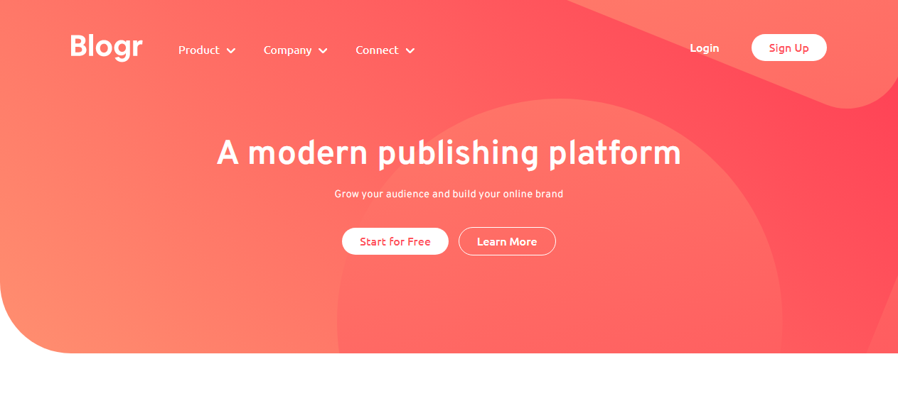

# Frontend Mentor - Blogr landing page solution

This is a solution to the [Blogr landing page challenge on Frontend Mentor](https://www.frontendmentor.io/challenges/blogr-landing-page-EX2RLAApP). Frontend Mentor challenges help you improve your coding skills by building realistic projects.

## Table of contents

- [Overview](#overview)
	- [The challenge](#the-challenge)
	- [Screenshot](#screenshot)
	- [Links](#links)
- [My process](#my-process)
	- [Built with](#built-with)

## Overview

### The challenge

Users should be able to:

- View the optimal layout for the site depending on their device's screen size
- See hover states for all interactive elements on the page

### Screenshot

### Links

- Solution URL: [Solution URL](https://www.frontendmentor.io/solutions/responsive-blogr-landing-page-9anupZxPFV)
- Live Site URL: [Live Site](https://judah1604.github.io/Blogr-Landing-Page/)

## My process

### Built with

- Semantic HTML5 markup
- CSS custom properties
- Flexbox
- CSS Grid
- Mobile-first workflow

## Author

- Website - [Judah Oyedele](https://judahoyedele.netlify.app)
- Frontend Mentor - [@Judah1604](https://www.frontendmentor.io/profile/Judah1604)
- Twitter - [@JudahOyedele](https://www.twitter.com/JudahOyedele)
